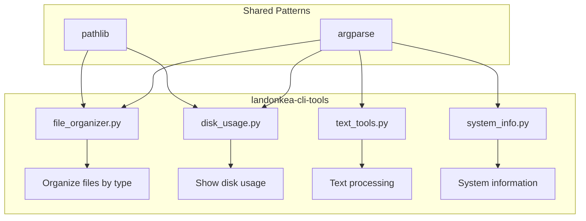
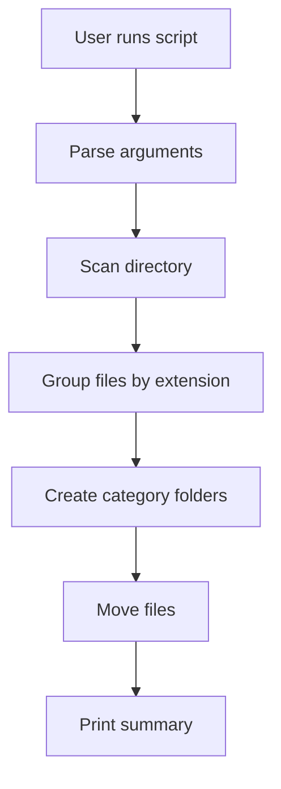
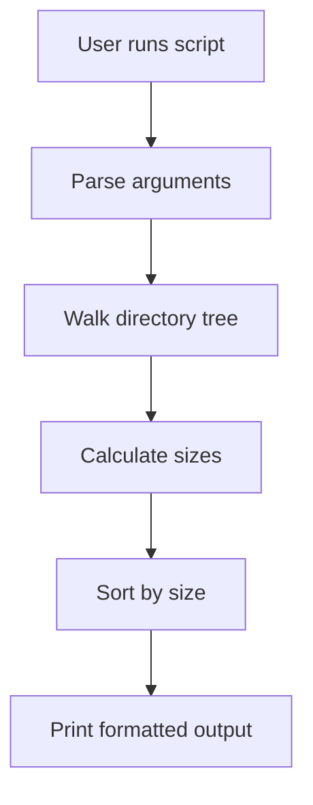

# landonkea-cli-tools - Design & Workflow

## High-Level Overview

## File Organizer Workflow

## Disk Usage Workflow

## File Relationships

| File | Purpose | Used By |
|------|---------|---------|
| `file_organizer.py` | Organize files by type | CLI |
| `disk_usage.py` | Show disk usage | CLI |
| `text_tools.py` | Text processing | CLI |
| `system_info.py` | System information | CLI |
| `tests/` | Test scripts | `pytest` |

## draw.io

[Open in draw.io](https://app.diagrams.net/#RCLI%20tools%20architecture)
